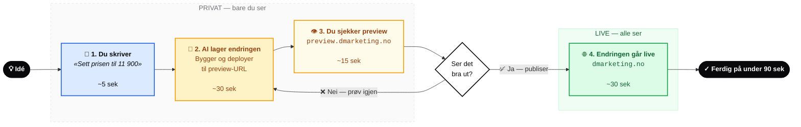
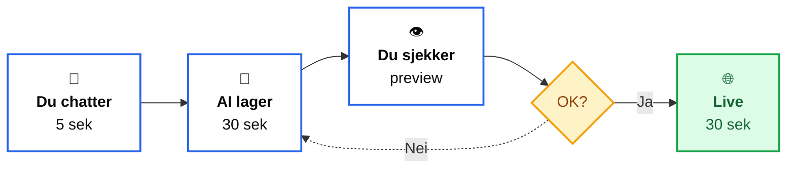
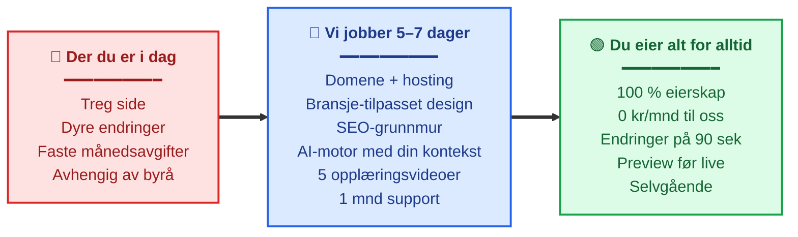
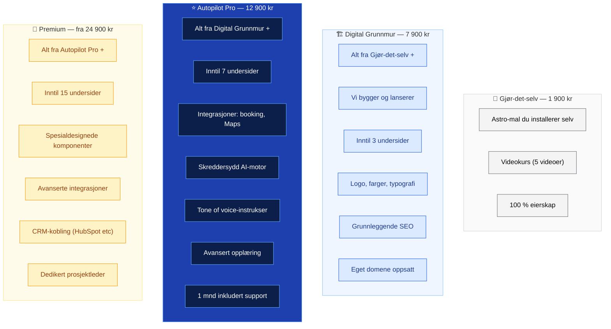

# Prosess-diagram — AI-Webmaster

Mermaid-diagram for bruk i demo-videoen (Scene 5) og opplæringsvideo 01.

---

## Hovedversjon — preview-loop



---

## Forenklet versjon — for slide i video



---

## Sammenligning — gammel modell vs. AI-Webmaster

```mermaid
flowchart TB
    subgraph Gammel [" 🐌 GAMMEL MODELL — webbyrå "]
        direction LR
        G1["📧 Du sender e-post"] --> G2["⏳ Venter 2–4 dager"]
        G2 --> G3["💸 Faktura<br/>1 500–7 500 kr"]
        G3 --> G4["✅ Endring live"]
    end

    subgraph Ny [" ⚡ AI-WEBMASTER "]
        direction LR
        N1["💬 Du chatter"] --> N2["👁️ Preview på 30 sek"]
        N2 --> N3["✅ Du publiserer"]
        N3 --> N4["🌐 Live på 90 sek totalt"]
    end

    classDef gammel fill:#FEE2E2,stroke:#DC2626,color:#991B1B,stroke-width:2px
    classDef ny fill:#DCFCE7,stroke:#16A34A,color:#166534,stroke-width:2px
    classDef gammelGroup fill:#FEF2F2,stroke:#FCA5A5
    classDef nyGroup fill:#F0FDF4,stroke:#86EFAC

    class G1,G2,G3,G4 gammel
    class N1,N2,N3,N4 ny

    style Gammel fill:#FEF2F2,stroke:#FCA5A5,color:#991B1B
    style Ny fill:#F0FDF4,stroke:#86EFAC,color:#166534
```



---

# Slik eksporterer du diagrammet til bildet du bruker i videoen

## Alternativ 1 — mermaid.live (raskest, gratis, ingen installasjon)

1. Gå til [mermaid.live](https://mermaid.live)
2. Lim inn diagram-koden (uten ` ```mermaid`-fence)
3. Klikk **Actions → PNG** (eller SVG for skarpeste kvalitet)
4. Sett `Width: 1920` og `Background: #FAFAFA` for video-bruk
5. Last ned

**Tips:** SVG lar deg skalere uten kvalitetstap. Bruk SVG hvis du legger det inn i CapCut.

## Alternativ 2 — VSCode Markdown Preview (hvis du redigerer mye)

1. Installer extension: **Markdown Preview Mermaid Support** (av Matt Bierner)
2. Åpne denne filen, trykk `Ctrl+Shift+V` → diagrammene rendres direkte
3. Høyreklikk → "Save image as" eller bruk Snipping Tool

## Alternativ 3 — GitHub render (allerede gjort)

GitHub renderer mermaid automatisk. Når du har pushet denne filen til GitHub:
- Åpne `demo-video-diagram.md` på github.com
- Du ser diagrammene rendret direkte
- Skjermdump dem hvis du vil

---

# Hvilken versjon bruker du hvor?

| Versjon | Brukes i |
|---|---|
| **Hovedversjon** | Scene 5 i demo-video (sentral illustrasjon) + opplæringsvideo 01 |
| **Forenklet** | Scene 1 (i bakgrunnen som visuelt anker) eller intro-thumbnail |
| **Sammenligning** | Scene 3 (alternativ til faktura-bildet) — men velg én, ikke begge |

---

---

## Reisen — fra dagens nettside til AI-Webmaster

**Brukes i Scene 5 (det vi gjør for deg) + på salgs-siden + i pakkeforslag-PDF.**

Dette er det viktigste diagrammet for å selge — det viser konkret hva kunden får for pengene.

```mermaid
flowchart LR
    subgraph IDAG [" 🔴 DER DU ER I DAG "]
        direction TB
        I1["📉 Treg eller utdatert nettside"]
        I2["💸 Faktura for hver endring<br/>1 500–7 500 kr"]
        I3["📅 Faste månedsavgifter<br/>1 500 kr/mnd"]
        I4["⏳ Venter 2–7 dager<br/>på enkleste endring"]
        I5["🔒 Eier ikke koden<br/>låst til byrået"]
    end

    subgraph JOBB [" 🔵 VI GJØR JOBBEN — 5 til 7 dager "]
        direction TB

        subgraph INFRA ["1. Infrastruktur "]
            J1["Domene registrert<br/>i ditt navn"]
            J2["GitHub-repo<br/>du eier 100 %"]
            J3["Cloudflare hosting<br/>(superrask globalt)"]
            J4["Preview-system<br/>satt opp"]
        end

        subgraph DESIGN ["2. Design og innhold "]
            J5["Bransje-tilpasset<br/>Astro-mal"]
            J6["Innhold overført<br/>fra gammel side"]
            J7["Logo, farger,<br/>typografi"]
            J8["Bilder optimalisert<br/>og redigert"]
        end

        subgraph SEO ["3. SEO og ytelse "]
            J9["Meta-tags og<br/>schema-markup"]
            J10["Sitemap +<br/>robots.txt"]
            J11["Lighthouse 95+<br/>(Google-vennlig)"]
        end

        subgraph AI_MOTOR ["4. AI-motor "]
            J12["Claude konfigurert<br/>med din bedrifts­kontekst"]
            J13["«Tone of voice»<br/>så AI skriver som deg"]
            J14["Bransje-instrukser<br/>(rørlegger / klinikk / etc)"]
        end

        subgraph OPPLAERING ["5. Opplæring og overlevering "]
            J15["5 opplærings­videoer<br/>(~28 min totalt)"]
            J16["15-min personlig<br/>gjennomgang"]
            J17["1 mnd inkludert<br/>support"]
        end
    end

    subgraph FERDIG [" 🟢 FRA DAG 8 — DU EIER ALT, FOR ALLTID "]
        direction TB
        F1["✓ 100 % eierskap<br/>til kode + innhold"]
        F2["✓ 0 kr/mnd til oss<br/>— for alltid"]
        F3["✓ Endringer på<br/>under 90 sekunder"]
        F4["✓ Privat preview<br/>før alt går live"]
        F5["✓ Selvgående —<br/>du trenger aldri ringe noen"]
    end

    IDAG ==> JOBB ==> FERDIG

    classDef pain fill:#FEE2E2,stroke:#DC2626,color:#991B1B,stroke-width:1.5px
    classDef work fill:#DBEAFE,stroke:#2563EB,color:#1E3A8A,stroke-width:1.5px
    classDef win fill:#DCFCE7,stroke:#16A34A,color:#166534,stroke-width:1.5px

    class I1,I2,I3,I4,I5 pain
    class J1,J2,J3,J4,J5,J6,J7,J8,J9,J10,J11,J12,J13,J14,J15,J16,J17 work
    class F1,F2,F3,F4,F5 win

    style IDAG fill:#FEF2F2,stroke:#FCA5A5,color:#991B1B
    style JOBB fill:#EFF6FF,stroke:#93C5FD,color:#1E3A8A
    style FERDIG fill:#F0FDF4,stroke:#86EFAC,color:#166534
    style INFRA fill:#FFFFFF,stroke:#93C5FD,color:#1E3A8A
    style DESIGN fill:#FFFFFF,stroke:#93C5FD,color:#1E3A8A
    style SEO fill:#FFFFFF,stroke:#93C5FD,color:#1E3A8A
    style AI_MOTOR fill:#FFFFFF,stroke:#93C5FD,color:#1E3A8A
    style OPPLAERING fill:#FFFFFF,stroke:#93C5FD,color:#1E3A8A
```



**17 konkrete leveranser** i mellom-fasen. Det er det som gjør 12 900 kr til en åpenbar deal — kunden ser alt arbeidet som gjøres for dem.

---

## Forenklet versjon av reisen (for video-bruk)

Hvis fullversjonen blir for tett på skjerm, bruk denne kompakte:



---

## Hva om kunden lurer på hva som er forskjellen mellom pakkene?

Bruk denne — viser hvilke av de 17 leveransene som er med i hver pakke:



---

# Hvilken versjon bruker du hvor?

| Versjon | Brukes i |
|---|---|
| **Hovedversjon (preview-loop)** | Scene 5 i demo-video + opplæringsvideo 01 |
| **Forenklet (preview-loop)** | Scene 1 (visuelt anker) eller intro-thumbnail |
| **Sammenligning gammel/ny** | Scene 3 (alternativ til faktura-bildet) |
| **Reisen — full** | **Scene 5** (det vi gjør) + salgsside + pakkeforslag-PDF |
| **Reisen — forenklet** | Scene 5 hvis full er for tett |
| **Pakke-forskjeller** | Scene 6 (priser) + pakkeforslag-PDF |

---

# Hvis du vil tilpasse

Endre tekst direkte i mermaid-koden over, eller åpne i [mermaid.live](https://mermaid.live) og rediger der med live-preview. Når du er fornøyd, kopier tilbake hit og commit.

Tre vanlige justeringer du kanskje vil gjøre:
- **Bytt fargene** til noe mer brand-spesifikt — endre `fill:` og `stroke:` i `classDef`-linjene
- **Forkort tekst** hvis det ser overfylt ut på liten skjerm
- **Bytt rekkefølge** — `flowchart LR` (venstre→høyre) vs `flowchart TB` (topp→bunn)
