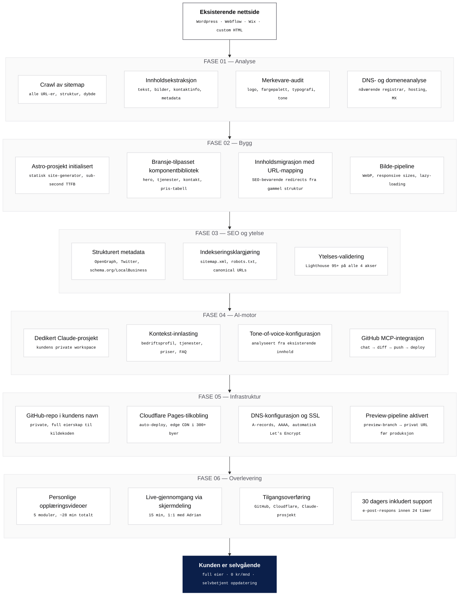

# Prosess- og leveransediagram — AI-Webmaster

To diagram for bruk i demo-video og opplæring:
1. **Migrasjons- og leveranseprosess** — viser hvordan vi tar deg fra dagens nettside til selvgående.
2. **Endringssyklusen** — hvordan en oppdatering flyter fra chat til live etter levering.

Stil: ren, monokrom, teknisk. Ingen emoji i hovedflyten. Bygget for å se ut som et arkitekturdiagram fra et seriøst dokument — ikke en markedsføringsslide.

---

## 1. Migrasjons- og leveranseprosess

Hovedillustrasjonen i Scene 5 og i pakkeforslag-PDFer.



**23 konkrete tekniske leveranser** fordelt over 6 faser. Total kalendertid: 5–7 dager. Total arbeidsinnsats fra kunde: under 1 time.

---

## 2. Endringssyklusen — etter levering

For Scene 1 og opplæringsvideo 02. Viser hva som skjer hver gang kunden gjør en endring.

```mermaid
flowchart LR
    Start["<b>Idé</b>"]:::neutral

    subgraph PRIVATE[" Privat — bare kunden ser "]
        direction TB
        S1["<b>01</b> · Kommando i chat<br/><span style='font-family:monospace;font-size:11px;color:#71717A'>«Sett pris til 11 900»</span><br/><span style='font-family:monospace;font-size:10px;color:#A1A1AA'>~5 sek</span>"]
        S2["<b>02</b> · Build og deploy til preview<br/><span style='font-family:monospace;font-size:11px;color:#71717A'>git push → Cloudflare build</span><br/><span style='font-family:monospace;font-size:10px;color:#A1A1AA'>~30 sek</span>"]
        S3["<b>03</b> · Verifisering på preview-URL<br/><span style='font-family:monospace;font-size:11px;color:#71717A'>preview.dmarketing.no</span><br/><span style='font-family:monospace;font-size:10px;color:#A1A1AA'>~15 sek</span>"]
    end

    Decision{"Godkjent?"}:::decision

    subgraph PUBLIC[" Live — alle ser "]
        S4["<b>04</b> · Merge til main<br/><span style='font-family:monospace;font-size:11px;color:#71717A'>preview → production deploy</span><br/><span style='font-family:monospace;font-size:10px;color:#A1A1AA'>~30 sek</span>"]
    end

    End["<b>Live på domenet</b><br/><span style='font-family:monospace;font-size:11px;color:#FFFFFF;opacity:0.7'>total tid: under 90 sekunder</span>"]:::output

    Start --> S1 --> S2 --> S3 --> Decision
    Decision -.->|"Avvik — prøv igjen"| S2
    Decision -->|"Godkjent"| S4 --> End

    classDef neutral fill:#FFFFFF,stroke:#71717A,color:#09090B,stroke-width:1.5px
    classDef step fill:#FFFFFF,stroke:#2563EB,color:#09090B,stroke-width:1px
    classDef decision fill:#FFFFFF,stroke:#09090B,color:#09090B,stroke-width:1.5px
    classDef output fill:#0B1F4A,stroke:#0B1F4A,color:#FFFFFF,stroke-width:1.5px

    class S1,S2,S3,S4 step

    style PRIVATE fill:#FAFAFA,stroke:#E4E4E7,color:#52525B,stroke-dasharray:5 5
    style PUBLIC fill:#F0FDF4,stroke:#BBF7D0,color:#166534
```



---

## Slik eksporterer du diagrammene til bilde

### Anbefalt: mermaid.live → SVG

1. Gå til [mermaid.live](https://mermaid.live)
2. Lim inn diagram-koden (kun innholdet mellom ` ```mermaid `-fence-ene)
3. Klikk **Actions → SVG**
4. Sett:
   - **Width:** `2400` (så det er skarpt på 4K-video)
   - **Background:** `#FAFAFA`
5. Last ned SVG-filen
6. Importer i CapCut som bildelag — den skalerer uten kvalitetstap

### Alternativ: GitHub render + screenshot

1. Pushet du allerede denne filen til GitHub? Da renderer GitHub mermaid automatisk.
2. Åpne `demo-video-diagram.md` på github.com
3. Skjermdump diagrammet i full bredde (Snipping Tool på Windows: `Win + Shift + S`)

---

## Hvis du vil tilpasse

### Endre fase-navn eller leveranse-tekster
Rediger denne filen direkte. Endringer vises i ren mermaid-syntaks.

### Bytte fra norsk til engelsk
Søk og erstatt fasenavn (FASE → PHASE). Resten følger.

### Justere fargene
Endre `classDef`- og `style`-linjene nederst i hvert diagram. Aksent-fargen `#0B1F4A` (navy) er konsistent på start/end-noder. `#2563EB` (brand-blå) er border på aktive steg.

### Vise færre faser i en kort versjon
Slett `subgraph FASE3` og `subgraph FASE4` for en 4-fase-versjon. Husk å fjerne dem fra `Start --> FASE1 --> ...`-linjen.

---

## Hvor brukes hvilket diagram?

| Diagram | Brukes i |
|---|---|
| **1. Migrasjons- og leveranseprosess** | Scene 5 i demo-video · pakkeforslag-PDF · salgs-side |
| **2. Endringssyklusen** | Scene 1 (visuelt anker) · opplæringsvideo 01 og 02 |
