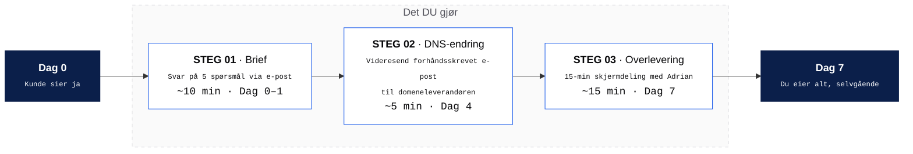

# Kundens innsats — den faktiske jobben

Den totale tidsbruken fra kunde i hele leveransen er **under 30 minutter, fordelt over 7 dager**. Dette er det eneste de gjør. Alt annet er vårt ansvar.

Brukes i:
- Demo-video, Scene 5 (visuelt anker mens Adrian leser opp leveranseprosessen)
- Velkomst-e-post som sendes når kunden svarer ja
- Pakkeforslag-PDF
- Salgssamtaler

---

## 1. Diagram — kundens tre handlinger



**Total tidsbruk fra kunde: ~30 min, fordelt over 7 dager.**

---

## 2. Detaljert tidslinje — hva skjer når

| Dag | Kundens innsats | Vår innsats | Status |
|---|---|---|---|
| 0 | Sier ja | Sender velkomst-e-post med 5 spørsmål + DNS-mal | Brief-fase startet |
| 1 | **Svarer på 5 spørsmål (10 min)** | Crawler eksisterende side, gjør whois på domenet | Analyse-fase |
| 2 | — | Bygger Astro-prosjekt, designer side | Bygg-fase |
| 3 | — | Innholdsmigrasjon, bilder, SEO-grunnmur | Bygg-fase |
| 4 | **Videresender DNS-mal (5 min)** | Setter opp Cloudflare, GitHub-repo, AI-motor | Infrastruktur-fase |
| 5 | — | DNS propagerer (24–48 t) · vi tester live-preview | Lansering-fase |
| 6 | — | Spiller inn personlige opplæringsvideoer | Overlevering-fase |
| 7 | **15-min skjermdeling med Adrian** | Tilgangsoverføring, support starter | Levert ✓ |

---

## 3. STEG 01 — Brief: de 5 spørsmålene

Sendes til kunden i velkomst-e-posten. Skal kunne svares på i én e-post.

```
Hei [Navn],

Velkommen om bord. For å komme i gang trenger jeg svar på 5 raske spørsmål.
Bare svar nedenfor — du trenger ikke gjøre noe annet på nåværende tidspunkt.

1. BEDRIFTSNAVN (slik det skal vises på siden):
   →

2. BY/REGION (for "Vi finner deg på Google" — f.eks. "Stavanger og omegn"):
   →

3. KONTAKT-TELEFON (det nummeret kundene dine skal ringe):
   →

4. LOGO — har du den allerede? Hvis ja, send som vedlegg (.png, .svg eller .ai).
   Hvis ikke, skriv "lager ny" og jeg fikser én for deg.
   →

5. FARGE — én farge som skal være "din" på siden. Hvis du ikke har en favoritt,
   skriv "velg for meg" og jeg matcher med bransjen din.
   →

Og hvis du har eksisterende nettside:
   - URL:
   - Hvem registrerte domenet (hvis du vet):

Det er det. Du hører fra meg igjen om 4 dager med en preview-link.

Mvh
Adrian
```

---

## 4. STEG 02 — DNS-endring: e-postmaler

Vi forhåndsutfyller riktig mal basert på hvilken registrar kunden bruker. Kunden bare videresender den.

### Hvordan vi finner ut hvilken registrar

```
$ whois dinbedrift.no | grep -i "registrar\|name server"
```

Eller bruk [domeneshop.no/sok](https://domeneshop.no/sok), [whois.norid.no](https://whois.norid.no) — gir registrar på 5 sekunder.

### Mal A — Domeneshop (~40 % av norske SMB)

> **Til:** support@domeneshop.no
> **Emne:** Endring av navnetjenere for [DOMENE.NO]
>
> Hei,
>
> Jeg ønsker å endre navnetjenerne for domenet [DOMENE.NO] som er registrert i mitt navn ([navn] · kundenummer [hvis kjent]).
>
> Vennligst sett følgende navnetjenere:
>
> ```
> NS1: [navn-1].ns.cloudflare.com
> NS2: [navn-2].ns.cloudflare.com
> ```
>
> Bekreft gjerne når endringen er gjennomført.
>
> Mvh
> [Kundens navn]

### Mal B — One.com

> **Til:** support@one.com
> **Emne:** Change nameservers for [DOMENE.NO]
>
> Hi,
>
> I'd like to change the nameservers for [DOMENE.NO] (registered in my name, account [account number if known]) to:
>
> ```
> NS1: [navn-1].ns.cloudflare.com
> NS2: [navn-2].ns.cloudflare.com
> ```
>
> Please confirm once the change is complete.
>
> Best regards
> [Kundens navn]

### Mal C — Generisk (alle andre registrarer som tar e-post)

> **Til:** [registrar support-e-post]
> **Emne:** Nameserver change request — [DOMENE.NO]
>
> Hello,
>
> I am the registered owner of [DOMENE.NO]. Please update the authoritative nameservers to:
>
> ```
> NS1: [navn-1].ns.cloudflare.com
> NS2: [navn-2].ns.cloudflare.com
> ```
>
> If you require additional verification (account login, identity confirmation, two-factor), please let me know.
>
> Regards
> [Kundens navn] · [Kundens e-post på registrert konto]

### Mal D — Domene holdt av gammelt webbyrå

> **Til:** [byrået]
> **Emne:** Avslutning av samarbeid og overføring av domene
>
> Hei,
>
> Jeg ønsker å avslutte vårt løpende samarbeid og flytte domenet [DOMENE.NO] til en ny leverandør.
>
> Vennligst send meg:
>
> 1. **Auth-koden (EPP-koden)** for [DOMENE.NO]
> 2. **Bekreftelse på at domenet er låst opp for overføring**
> 3. En oversikt over fakturaer som eventuelt forfaller
>
> Domenet er registrert i bedriftens navn ([Bedriftsnavn], org.nr [XXX XXX XXX]) og jeg ber om at det behandles innen 7 dager.
>
> Mvh
> [Kundens navn]

**Når kunden får auth-koden, sender de den videre til oss.** Vi gjør resten.

---

## 5. STEG 03 — Overlevering

15-min skjermdeling via Google Meet. Vi går gjennom:

1. Hvor er Claude Code (genvei + bokmerke)
2. Hvordan en endring fungerer fra start til live
3. Hvor er preview-URL-en
4. Hvor er live-URL-en
5. Hvor melder kunden inn ting de ikke får til ("svar på denne e-posten")

Etter samtalen sender vi en oppfølgings-e-post med:
- Loom-opptak av samtalen (slik at de kan se den igjen)
- Lenker til alle 5 opplæringsvideoer
- Direkte-lenke til support hvis de står fast

---

## 6. Edge cases — det som *kan* gå galt på kundens side

| Problem | Vår løsning |
|---|---|
| Kunde vet ikke hvem som registrerte domenet | Vi gjør whois og sender dem registrar-info pluss riktig mal |
| Kunde har glemt passord til registrar-konto | Mal C funker uavhengig — registrar identifiserer via e-post |
| Domene holdt av gammelt byrå som ikke svarer | Vi eskalerer via Norid (.no) eller registrar-hotline |
| Kunde har egen e-post på domenet (kari@bedrift.no) | Vi setter opp MX-records hos Cloudflare slik at e-posten fortsetter å fungere |
| Kunde får 2FA-utfordring fra registrar | Vi ringer dem og hjelper i sanntid (5 min) |
| Kunde vil at vi skal ta over hele domenet | Vi blir ny registrar; de slipper fornyelser fremover |

---

## 7. Velkomst-e-posten (sendes Dag 0)

Den ene e-posten som starter alt. Inneholder steg 01 (5 spørsmål), forhåndsvarsel om steg 02 (DNS), og Calendly-lenke for steg 03 (overlevering).

```
Emne: Velkommen om bord — her er det vi trenger fra deg

Hei [Navn],

Takk for tilliten. Du er nå offisielt på listen — vi starter byggingen
i dag, og du har en ferdig nettside klar i hendene innen 7 dager.

I løpet av disse 7 dagene gjør du tre korte ting. Jeg har laget alt så
enkelt som mulig — total tidsbruk fra deg er rundt 30 minutter.

━━━━━━━━━━━━━━━━━━━━━━━━━━━━━━━━━

STEG 1 · I DAG  ·  Svar på 5 spørsmål (10 min)

  1. Bedriftsnavn:
  2. By/region:
  3. Telefon:
  4. Logo (vedlegg eller "lager ny"):
  5. Farge ("velg for meg" går fint):

  Eksisterende nettside (hvis du har): ___________
  Vet du hvem som registrerte domenet ditt? ___________

━━━━━━━━━━━━━━━━━━━━━━━━━━━━━━━━━

STEG 2 · DAG 4  ·  Videresend en forhåndsutfylt e-post (5 min)

  Du får en e-post fra meg på dag 4. Den er ferdig skrevet til
  domeneleverandøren din. Du videresender den. Det er det.

━━━━━━━━━━━━━━━━━━━━━━━━━━━━━━━━━

STEG 3 · DAG 7  ·  15-min overlevering (15 min)

  Velg en tid som passer her: [Calendly-link]
  Vi tar det på Google Meet — du trenger ikke installere noe.

━━━━━━━━━━━━━━━━━━━━━━━━━━━━━━━━━

Det var det. Hvis du har spørsmål underveis: bare svar på denne mailen.

Mvh
Adrian
```

---

## 8. Hva dette gjør for salget

Når kunden ser dette diagrammet eller får denne e-posten, skjer tre ting:

1. **Tvilen om "vil dette stjele tiden min" forsvinner** — 30 min er konkret og kort.
2. **De ser at du har gjort dette før** — fordi alt er forhåndsstrukturert.
3. **De har en mental modell de kan dele med ektefelle / regnskapsfører** — "det er bare 3 ting jeg må gjøre, og total tidsbruk er en halvtime."

Den siste er den viktigste. De fleste B2B-kjøp i SMB-segmentet diskuteres med én ekstra person før signatur. Hvis kunden ikke kan oppsummere prosessen i én setning, faller dealen.

**"Tre steg, en halvtime, du eier alt etterpå."** — det er én setning.
